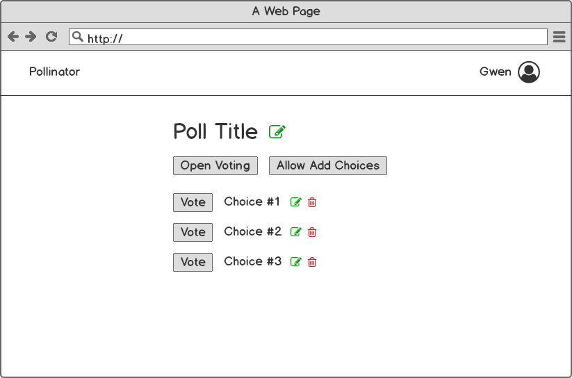

# Django GraphQL

Instructions for setting up GraphQL in a Django Project.

[Graphene documentation](https://docs.graphene-python.org/projects/django/en/latest/)

**Table of Contents:**

1. [Why Graphql?](#why-graphql)
1. [Graphene Installation](#graphene-installation)
1. Creating Schemas
1. Using Graphiql

## Why Graphql?

- Get only the data that you want
- Easier to manage endpoints

## Graphene Installation

Install Graphene: `pip install django_graphene`

## Creating Schemas

```py
# cookbook/schema.py
import graphene
from graphene_django import DjangoObjectType

from cookbook.ingredients.models import Category, Ingredient

class CategoryType(DjangoObjectType):
    class Meta:
        model = Category
        fields = ("id", "name", "ingredients")

class IngredientType(DjangoObjectType):
    class Meta:
        model = Ingredient
        fields = ("id", "name", "notes", "category")

class Query(graphene.ObjectType):
    all_ingredients = graphene.List(IngredientType)
    category_by_name = graphene.Field(CategoryType, name=graphene.String(required=True))

    def resolve_all_ingredients(root, info):
        # We can easily optimize query count in the resolve method
        return Ingredient.objects.select_related("category").all()

    def resolve_category_by_name(root, info, name):
        try:
            return Category.objects.get(name=name)
        except Category.DoesNotExist:
            return None

schema = graphene.Schema(query=Query)
```

---

> The secret to doing anything is believing that you can do it. Anything that you believe you can do strong enough, you can do. Anything. As long as you believe.
>
>> No pressure. Just relax and watch it happen.

-- *Bob Ross*

[](https://docs.graphene-python.org/projects/django/en/latest/)

Some text <br>some more text

## Roadmap

- [x] Task #1
- [ ] Task #2
